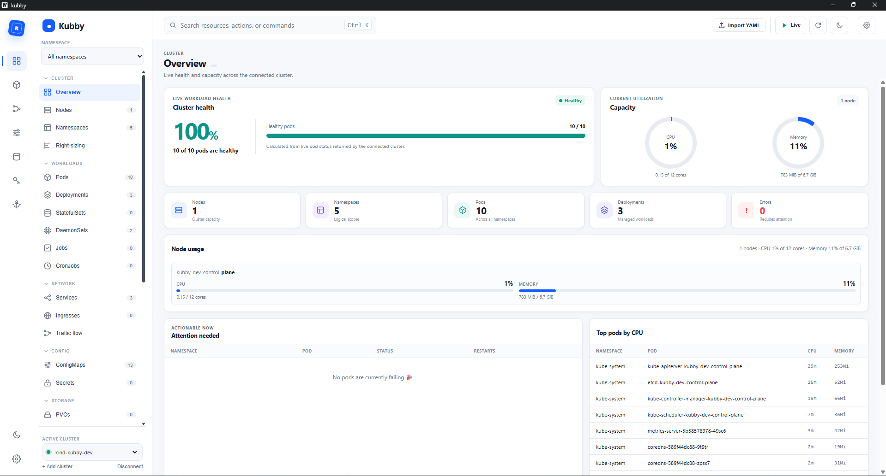
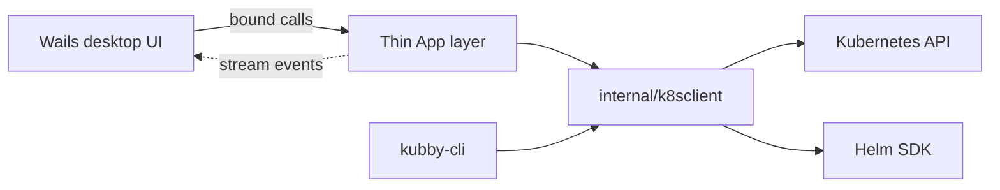

<div align="center">

# Kubby

### A personal Kubernetes desktop app that helps you see, understand, and operate your cluster.

Kubby connects directly to the Kubernetes API from your desktop—no in-cluster
agent, no server to maintain, and no requirement to memorize every `kubectl`
command.

[](https://go.dev/)
[](https://wails.io/)
[](https://kubernetes.io/)


[Build Kubby](docs/BUILD.md) · [Product specification](docs/SPECIFICATION.md) · [Architecture](src/kubby/ARCHITECTURE.md) · [Developer verification](src/kubby/docs/verification.md)

</div>

<p align="center">
  
</p>

<p align="center"><em>Cluster health, capacity, workloads, and operations in one desktop workspace.</em></p>

## Why Kubby?

Most Kubernetes tools either expect a terminal-first workflow or stop at showing
raw resource data. Kubby is designed for personal and lab clusters where one
desktop application should make the cluster easy to explore, diagnose, and
operate.

<table>
  <tr>
    <td width="33%" valign="top">
      <h3>🔭 Observe</h3>
      Browse built-in and custom resources, inspect health, events, metrics,
      relationships, and traffic paths.
    </td>
    <td width="33%" valign="top">
      <h3>🧭 Diagnose</h3>
      Follow logs, examine live manifests, understand failures, and ask an AI
      assistant about the resource currently in view.
    </td>
    <td width="33%" valign="top">
      <h3>⚙️ Operate</h3>
      Edit and apply YAML, manage workloads, use exec and port-forward, and work
      with Helm without installing an in-cluster component.
    </td>
  </tr>
</table>

## What is included

| Area | Capabilities |
|---|---|
| **Cluster overview** | Health summary, node capacity, live metrics, failing workloads, recent events, and right-sizing guidance. |
| **Resource explorer** | Sortable and filterable tables, details, YAML, events, relationships, namespace scoping, and global search. |
| **Custom resources** | Discovery-backed sections for CRD-defined resources using unambiguous `Kind.group` references. |
| **Diagnostics** | Logs, exec, port-forward, traffic topology, resource evidence, and provider-selectable AI assistance. |
| **Operations** | Create/apply, delete, scale, restart, pause/resume, rollback, cordon/drain, and CronJob triggering. |
| **Helm** | Releases, history, rollback, repositories, Artifact Hub search, chart installation, and dry-run previews. |
| **Developer tooling** | `kubby-cli` exercises the same Go Kubernetes layer as the desktop application. |

## Architecture at a glance



- **Desktop shell:** Wails v2
- **Backend:** Go, client-go, dynamic/discovery/metadata clients, and Helm SDK
- **Frontend:** Vanilla JavaScript, Vite, and CodeMirror
- **Deployment model:** local desktop process connecting through the user's
  kubeconfig

The implementation source lives in [`src/kubby/`](src/kubby/). Start with the
[architecture map](src/kubby/ARCHITECTURE.md) before changing application code.

## Build Kubby

Dependencies, PowerShell/WSL detection, reproducible frontend installation,
backend checks, Windows/Linux Wails targets, artifact verification, and safe
cleanup are centralized in one guide:

> **[Open the complete build guide → `docs/BUILD.md`](docs/BUILD.md)**

| Target | Canonical artifact |
|---|---|
| Windows x86-64 | `src/kubby/build/bin/kubby.exe` |
| Linux x86-64 | `src/kubby/build/bin/kubby` |

A Windows executable can be built natively or cross-built from WSL. A
cross-built artifact still needs a native Windows visual check before release.

## Documentation

The repository intentionally has two documentation levels:

| Location | Purpose |
|---|---|
| [`docs/`](docs/) | Repository- and product-level material: build, specification, agent workflows, and defect history. |
| [`src/kubby/ARCHITECTURE.md`](src/kubby/ARCHITECTURE.md) | System map and cross-cutting implementation invariants. |
| [`src/kubby/docs/`](src/kubby/docs/) | Feature-owned technical branches for frontend, Helm, permissions, streaming, performance, and other subsystems. |

Choose the entry point that matches your task:

- **Prepare or build a machine:** [`docs/BUILD.md`](docs/BUILD.md)
- **Understand product scope:** [`docs/SPECIFICATION.md`](docs/SPECIFICATION.md)
- **Change implementation:** [`src/kubby/ARCHITECTURE.md`](src/kubby/ARCHITECTURE.md)
- **Verify behaviour:** [`src/kubby/docs/verification.md`](src/kubby/docs/verification.md)
- **Use project agents:** [`docs/AGENT_WORKFLOWS.md`](docs/AGENT_WORKFLOWS.md)

## Repository layout

```text
kubby/
├── README.md
├── AGENTS.md
├── screenshot/
├── docs/
│   ├── BUILD.md
│   ├── SPECIFICATION.md
│   ├── AGENT_WORKFLOWS.md
│   └── bug.txt
└── src/kubby/
    ├── app.go
    ├── internal/k8sclient/
    ├── cmd/kubby-cli/
    ├── frontend/
    ├── ARCHITECTURE.md
    └── docs/
```

Generated dependencies, bindings, bundles, and binaries are not source. Do not
hand-edit `node_modules/`, `frontend/wailsjs/`, `frontend/dist/`, or `build/bin/`.

## Project status

Kubby is a personal project under active development. Requirements and current
implementation status are tracked in
[`docs/SPECIFICATION.md`](docs/SPECIFICATION.md). The project license has not yet
been selected.
