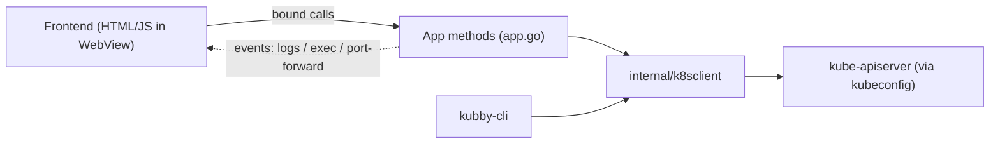

# Kubby — Product & Requirements Specification

> **Status:** Living document · **Last reviewed:** July 2026
> **Audience:** the project owner and any contributor. This document explains *why Kubby exists* and *what it must do*. Start at the repository [`README`](../README.md), use [`BUILD.md`](BUILD.md) for the canonical build procedure, and see [`../src/kubby/ARCHITECTURE.md`](../src/kubby/ARCHITECTURE.md) for implementation structure.

---

## 1. Overview

**Kubby** is a **personal desktop application for managing Kubernetes clusters**. You open it (double-click, no terminal), point it at a `kubeconfig`, and it connects directly to the cluster's API server to browse, inspect, diagnose, and operate resources through a Lens-style graphical interface.

Kubby is deliberately **single-user and agent-less**: it needs nothing installed inside the cluster — only a `kubeconfig`, exactly like Lens, Headlamp, or k9s. It is not an enterprise fleet manager (unlike Rancher) and it is not a read-only viewer (unlike a bare dashboard): beyond listing resources, it performs real operations and, uniquely, offers **AI-assisted diagnosis** of failing resources.

The source lives in this repository under [`../src/kubby/`](../src/kubby/); it is not a separate repo.

## 2. Problem statement

Managing a personal or lab cluster with `kubectl` alone is slow and error-prone: you memorize commands, copy-paste names, and manually correlate events, logs, and YAML to understand *why* something is broken. Existing GUIs solve the browsing problem but stop short of explaining failures. Kubby's thesis: a personal cluster manager should not just *show* you a `CrashLoopBackOff` — it should help you *understand and fix* it.

## 3. Target users

| Persona | Description | Needs |
|---|---|---|
| **Primary — the owner** | A DevOps learner/engineer running personal or lab clusters (kind, minikube, or a small cloud cluster). | Fast visual browsing, one-click operations, log/exec/port-forward, and plain-language help when things break. |
| Usage model | One user, one machine, one active cluster at a time (multiple clusters can be registered and switched). | No multi-user, no authentication layer, no shared server. |

## 4. Product positioning

| Tool | Model | Kubby's difference |
|---|---|---|
| **Lens / OpenLens** | Desktop GUI, agent-less | Kubby is open and self-contained; adds AI diagnosis and an embedded Helm workflow. |
| **Headlamp** | Desktop/web GUI, agent-less | Kubby adds diagnostic actions (drain, rollback, trigger) and AI explanations rather than mostly viewing. |
| **k9s** | Terminal UI | Kubby is a graphical desktop app for users who prefer a mouse-driven, discoverable UI. |
| **Rancher** | Enterprise fleet management, in-cluster components | Kubby is intentionally personal and agent-less — no fleet, no server, no CRDs installed. |

**One-line positioning:** *the personal, agent-less Kubernetes desktop app that explains failures, not just lists them.*

## 5. Core user workflow

1. Launch the app (double-click) → **Welcome** screen.
2. Provide a `kubeconfig` in one of two ways: **pick a file** via the OS dialog, or **paste** its contents into a text box.
3. Choose a **context** and click **Connect**. On success the app switches to the **Dashboard**.
4. The Dashboard lists nodes, namespaces, and workloads, and visually flags resources in error states (`CrashLoopBackOff`, `ImagePullBackOff`, `Pending`, …). A **namespace selector** scopes the view.
5. Inspect and operate resources without typing `kubectl`: view YAML/details/events, stream logs, exec, port-forward, scale/restart/rollback, and ask the AI to explain a failing resource.

## 6. Scope

### 6.1 In scope

- Connecting to existing clusters via `kubeconfig` (file or pasted content), multiple contexts.
- Read/inspect of the common resource kinds across all namespaces or one namespace.
- Write operations with explicit confirmation (edit YAML, scale, restart, rollback, cordon/drain, delete, create/apply).
- Diagnostics: events, logs, live metrics, relationship graphs, network topology, and AI explanations.
- Embedded Helm: manage releases, add/browse repositories, search Artifact Hub, install charts.
- A secondary CLI (`kubby-cli`) sharing the same core logic, for quick debugging and verification.

### 6.2 Out of scope (at least for now)

- **Cluster lifecycle** — creating, upgrading, or deleting clusters.
- **Multi-user / RBAC of the tool itself**, teams, or enterprise fleet management.
- **GitOps enforcement** and a third-party **plugin system**.
- Running any component **inside** the cluster (no agent, no operator).

## 7. Functional requirements

Requirements are grouped by capability. **Status** legend: ✅ implemented · 🟡 partial · ⬜ planned.

### 7.1 Connection & clusters

| ID | Requirement | Status | Notes |
|---|---|---|---|
| FR-1 | Desktop GUI launched by double-click (not CLI-only). | ✅ | Wails app; separate **Welcome** and **Dashboard** screens. |
| FR-2 | Load a `kubeconfig` by file picker **or** by pasting its contents; choose a context; connect. | ✅ | First connect can take 15–30 s behind a corporate security agent; a "Connecting…" overlay and a 30 s connect timeout make this legible rather than looking hung. |
| FR-3 | Register and switch between **multiple clusters** without returning to Welcome. | ✅ | Sidebar cluster dropdown, **+ Add cluster**, per-cluster disconnect. |
| FR-4 | Remember recent connections for one-click reconnect. | ✅ | Stored at `%AppData%/kubby/recent.json`; **only file paths + context** are persisted — pasted content (which may contain credentials) is never written to disk. |

### 7.2 Resource browsing & inspection

| ID | Requirement | Status | Notes |
|---|---|---|---|
| FR-5 | List the common resource kinds as sortable, filterable tables. | ✅ | ~25 kinds: Nodes, Namespaces, Pods, Deployments, ReplicaSets, StatefulSets, DaemonSets, Jobs, CronJobs, Services, Ingresses, ConfigMaps, Secrets, PVCs, PersistentVolumes, StorageClasses, ServiceAccounts, Roles, RoleBindings, ClusterRoles, ClusterRoleBindings, plus the **Ecosystem** group (CRDs, Helm Releases, Helm Repos, ResourceQuotas, LimitRanges). |
| FR-6 | Namespace selector to scope namespaced views. | ✅ | Applies to all namespaced tables. |
| FR-7 | A detail drawer per resource: metadata, labels, annotations, kind-specific fields, and **Events** (like `kubectl describe`). | ✅ | Slide-over drawer with tabbed content. |
| FR-8 | Relationship graphs with click-to-navigate. | ✅ | Deployment→ReplicaSet→Pod, Service→Pod, Ingress→Service→Pod; each node opens its own drawer. |
| FR-9 | **Node → Pods** and **Namespace overview**. | ✅ | Clicking a Node lists the pods scheduled on it; clicking a Namespace shows per-kind counts (click a card to jump into that view, scoped). |
| FR-10 | **Global search** across kinds and namespaces. | ✅ | Command palette (Ctrl+K) searches real resource names across the cluster and opens the match directly. |
| FR-11 | **Traffic flow** view — the entry-point→Service→Pod topology for the cluster/namespace, for **both Kubernetes Ingress and Istio**. | ✅ | Dedicated view under *Network*. Each request path is laid out in lanes (Route → Service → Pods) with per-hop health, host/path rules, service type/ports and pod readiness; summary tiles count entry points, routed vs. internal services, endpoint pods and **broken paths**; filter by name/host and toggle "only broken paths". A hop that routes nowhere (missing Service, selector matching no Pod, no ready Pod) is called out where it breaks. Objects being deleted are excluded. **Istio** is detected automatically and rendered in the same lanes, badged `Gateway`: listener ports and TLS from the Gateway's servers, the ingress-gateway's own address, routes attributed to the **VirtualService** that created them (clickable), destination hosts resolved short/namespaced/FQDN with out-of-cluster hosts marked *External*, and two Istio-specific checks — a Gateway selector matching no ingress-gateway Pod, and a `credentialName` TLS secret missing from the **ingress gateway's** namespace. Gateways are found cluster-wide even in a namespace-filtered view, since they conventionally live in `istio-system`. |

### 7.3 Health & diagnostics

| ID | Requirement | Status | Notes |
|---|---|---|---|
| FR-12 | Automatically flag resources in error states. | ✅ | Red row + badge for failing Pods/Deployments/etc.; sidebar count badges carry a red dot when a kind has failures. |
| FR-13 | Overview dashboard summarizing cluster health. | ✅ | Per-node CPU/memory meters in a responsive grid — cluster-wide totals in the card header, percentages coloured by pressure (amber ≥70%, red ≥90%), node names opening their drawer — plus top pods by CPU, cluster-wide recent events, and the list of failing pods (usage data requires metrics-server). |
| FR-36 | **Right-sizing** — say whether what was reserved bears any relation to what is used. | ✅ | A dedicated view under *Cluster*. Kubby already listed ResourceQuotas and LimitRanges and already read metrics-server; neither answers the question on its own, so this joins them: per-container requests and limits against live usage, per-namespace totals with quota headroom, and the cluster's allocatable capacity (Ready nodes only) to give the totals a scale. Findings are named in words rather than left to the reader — OOMKilled, memory near its limit, no memory limit at all, a request being used at 1%. **A value the container never declared is shown as `—`, never `0`**, since several findings exist precisely because nothing was declared. Aggregate conclusions are separated into short advice lines ("18 of 22 containers declare no memory limit; a LimitRange would set a default in one place — these namespaces have none"), because a list that flags every container ranks nothing; a toggle narrows the table to OOMKills and near-limit memory. Thresholds are deliberately conservative, with floors below which "over-provisioned" is not claimed. Works without metrics-server, saying so, since the declaration findings need no measurement. Read-only and entirely derived. Also `kubby-cli sizing`. |
| FR-14 | View Pod/container logs in the UI. | ✅ | Container picker, ~500 lines, **live follow (streaming)**, in-view line filter, download to file. |
| FR-15 | **AI assistant, scoped to a resource.** Ask questions about the resource you are looking at; Kubby attaches its live events, logs and manifest to every question. | ✅ | An **Ask AI** tab in the drawer (also reachable from the row menu): starter questions tuned per kind, a multi-turn thread, copy-answer, and a header stating exactly what evidence is attached with a **"See exactly what is sent"** viewer. Unconfigured shows a setup card, never an error. Provider chosen in **Settings**: **Ollama (local — nothing leaves the machine)**, **Anthropic (Claude)**, or any **OpenAI-compatible** endpoint; plus an answer-language preference. Config (incl. API key) is stored locally at `%AppData%/kubby/ai.json` (mode 0600) and sent only to the chosen provider. |

### 7.4 Operations (writes — always confirmed)

| ID | Requirement | Status | Notes |
|---|---|---|---|
| FR-16 | View and edit YAML, with a diff preview before saving. | ✅ | `status` and `managedFields` are stripped from the editor; **Diff** shows the change against the loaded version. The editor is a real code editor (CodeMirror), not a plain text box: YAML syntax highlighting, line numbers, folding, and **Tab that indents** — in a `<textarea>` Tab moved focus out of the box, which for indentation-sensitive text was actively hostile. Line numbers also let a failed apply point at the document that failed, with a red gutter marker on its opening line. The same editor is used by Create, Import YAML and the Helm values boxes. |
| FR-17 | Create resources and apply arbitrary YAML — **any kind the cluster serves, including custom resources**. | ✅ | **+ Create** offers per-kind templates; **Import YAML** applies pasted/edited YAML with create-or-update semantics (server-side apply) and multi-document (`---`) support, à la Rancher. Each document's `apiVersion` + `kind` is resolved against the cluster's own API discovery, so CRD-defined kinds (Istio, cert-manager, Argo, Gateway API…) need no configuration; a CRD installed after connecting is picked up on retry. Server-owned metadata (`resourceVersion`, `uid`, `managedFields`, `status`) is stripped so `kubectl get -o yaml` output can be pasted directly; a namespaced object without `metadata.namespace` goes to `default`. Every document is attempted even if one fails, and the result is a per-document report (`created`/`updated`, kind, namespace, apiVersion). Two manifests pasted **without** a `---` separator are rejected with that explanation rather than silently applying only the last. |
| FR-34 | **See what a manifest would change before applying it** — a real dry-run diff, not a client-side guess. | ✅ | A **Preview** button in Create / Import YAML sends every document as a server-side apply with `DryRun: All` and diffs the object the server says would result against the object that is live now, per document, labelled `create` / `update` / `unchanged`. Because the server does the merging, the preview shows its defaulting, admission mutation (an injected sidecar) and field-ownership resolution — none of which a client-side comparison could show. Long objects are collapsed to the changed lines plus context. Two limits are inherent to dry-run and are reported per document rather than hidden: an admission webhook that does not declare `sideEffects: None`/`NoneOnDryRun` makes the apiserver refuse the dry run, and a dry run creates nothing — so a bundle that creates a Namespace and then fills it cannot preview the later documents, which is detected and explained instead of surfacing a bare "not found". Also available as `kubby-cli diff -f <file>`. |
| FR-35 | **Offer only the actions this token can perform.** | ✅ | On opening a view or a drawer, Kubby asks the cluster via `SelfSubjectAccessReview` what the connected identity may do to that kind in that namespace, and disables — never hides — what it may not, with the reason in the tooltip ("Your token cannot delete Pod in nexus"). Pod subresources are probed separately, because a role granting `pods` says nothing about `pods/log` or `pods/exec`; the Logs and Terminal tabs follow those answers, not the Pod's. Verbs are the ones the API wants rather than the ones the labels suggest (a rolling restart is a `patch`; triggering a CronJob needs `create` on **Job**). **A permission Kubby could not check counts as allowed**: greying out the interface of a user who does have access would be a worse failure than a click that fails, and the apiserver remains the real enforcer regardless. Answers are cached per connection and cleared on cluster switch. Import YAML and Drain are deliberately not gated — see `docs/permissions.md`. |
| FR-18 | Delete resources with confirmation; bulk-select + bulk delete. | ✅ | Checkbox selection across a table; a single confirm dialog. |
| FR-19 | Workload operations. | ✅ | **Deployment:** scale, restart, pause/resume rollout, rollout history + rollback. **StatefulSet & DaemonSet:** rolling restart. **CronJob:** trigger now. |
| FR-20 | Node operations. | ✅ | Cordon, uncordon, drain (evicts non-DaemonSet pods). |
| FR-21 | Interactive **exec** and **port-forward** from the drawer. | ✅ | Line-mode terminal (TTY off); multiple concurrent port-forward tunnels. |
| FR-22 | Reveal decoded Secret values on demand. | ✅ | Values decoded server-side, shown per key with reveal/hide. |

### 7.5 Helm

| ID | Requirement | Status | Notes |
|---|---|---|---|
| FR-23 | Manage installed releases. | ✅ | List; view **Resources + live health**, **Values / Manifest / Notes**; **History** with diff-vs-current and **rollback**; **Upgrade values** with a dry-run **preview diff**; **run tests**; **uninstall**. |
| FR-24 | Discover and install charts. | ✅ | Search **Artifact Hub**; install with a version dropdown, real default `values.yaml`, README, maintainer/home links, and a dry-run preview. |
| FR-25 | Manage chart repositories. | ✅ | Add / remove / update repos (writes the user's `repositories.yaml`); browse and install charts from a repo; repository URLs are clickable. |

Helm is implemented **in-process** via the Helm Go SDK — no `helm` binary and no Tiller. Search/install/browse require internet access.

### 7.6 User experience

| ID | Requirement | Status | Notes |
|---|---|---|---|
| FR-26 | Instant per-view filter, row counts, and click-to-sort on every column. | ✅ | |
| FR-27 | Information-rich tables (Age column, per-row ⋯ action menu; Pods also show live CPU/memory, IP, node). | ✅ | Lens/Headlamp-style. |
| FR-28 | Command palette (Ctrl+K) for navigation, namespace/cluster switching, actions, and resource search. | ✅ | Keyboard-driven. Offers every section, including the dynamic custom-resource ones, and the resource search covers **all** kinds the UI has a section for — custom resources included. |
| FR-33 | **Custom resources are first-class sections.** Any kind the cluster's CRDs define gets its own sidebar entry, list view and drawer. | ✅ | A **Custom Resources** group is built from the CRD list at connect time (Istio, cert-manager, Argo, Gateway API…), each with a generic Namespace / Name / Status / Age table drilling into the usual Details / YAML / Events / Delete drawer, and each findable in the command palette. Hidden entirely on a cluster with no CRDs. Deliberately no count badges — that would be one list request per CRD on every refresh. Capped at 60 kinds, with the overflow stated rather than hidden. |
| FR-29 | Collapsible sidebar groups, consistent line-icon set, and a polished theme with light/dark modes. | ✅ | Accordion groups (state persisted); SVG icons; **Nord** color theme. |
| FR-30 | Live auto-refresh mode. | ✅ | Refreshes the current view every 5 s; pauses while a selection/drawer/modal/palette is open. |
| FR-31 | Native browser popups replaced by in-app dialogs. | ✅ | Stackable, theme-aware confirm/alert dialogs. |

### 7.7 Tooling

| ID | Requirement | Status | Notes |
|---|---|---|---|
| FR-32 | A secondary CLI sharing the app's core logic for quick debugging and verification. | ✅ | `kubby-cli` (get, yaml, logs, events, apply, scale, restart, port-forward, exec, cordon/uncordon, rollout, helm-*, search, node-pods, ns-summary, netflows, diag). Not the primary interface — a developer aid. |

## 8. Non-functional requirements

| ID | Requirement | Status | Notes |
|---|---|---|---|
| NFR-1 | **Agent-less.** No components installed in the cluster; only a `kubeconfig`. | ✅ | Matches Lens/Headlamp/k9s. |
| NFR-2 | **Local-only.** Runs on a personal Windows machine with no external infrastructure. | ✅ | The one optional outbound dependency is the user-configured AI provider and Artifact Hub for Helm search. |
| NFR-3 | **Safety.** No write to a resource without explicit user confirmation. | ✅ | Every destructive action has a confirm dialog. |
| NFR-4 | **Credential hygiene.** Never persist pasted kubeconfig content; store the AI API key with restrictive permissions. | ✅ | `recent.json` stores only file paths; `ai.json` is written mode 0600. |
| NFR-5 | **Responsiveness under a slow first connection.** The UI must not appear hung during a 15–30 s first TLS handshake. | ✅ | 30 s connect timeout + explanatory overlay. |
| NFR-8 | **A problem must be reportable.** The running build must be identifiable, and its environment capturable, without the user knowing where to look. | ✅ | `internal/buildinfo` is the single version identity for both binaries (`-dev` suffix on unreleased builds; commit/date from Go's embedded VCS stamps once the source is a checkout). **Settings → About** shows it; **Copy diagnostics** captures version, platform, the connected cluster's Kubernetes version and capabilities, the AI provider, and the last error shown. From the CLI: `--version` and `diagnostics`. Every probe is best-effort so a half-working connection still produces a report. The report carries **no API key, no kubeconfig content and no resource data**, and is headed "review before sharing"; a test asserts the key cannot appear. |
| NFR-7 | **A view or namespace change must feel immediate.** Refreshing the sidebar and the current view must not visibly stall the UI. | ✅ | Three rules, all easy to regress. The rest.Config runs at **QPS 50 / Burst 100** (client-go's controller-oriented default of 5/10 makes every request past the burst sleep, which dominated the lag). Fan-out happens **in Go**, concurrently, in one bound call per screen — not one bound call per kind from JavaScript. Anything that only needs a count or a name uses **metadata-only** lists, so counting Secrets does not transfer their values. A namespace change additionally skips cluster-scoped kinds, whose counts cannot have changed. Measured on a one-node kind cluster, filling the sidebar went from 930 ms to 73 ms. |
| NFR-6 | **Open source with a clear license.** | ⬜ | License not yet chosen — see §11. |

## 9. Architecture summary

Kubby is a **Wails v2** desktop application: a **Go** backend compiled into a single executable, with an **HTML/CSS/JS** frontend rendered in the OS WebView (WebView2 on Windows). The frontend never talks to Kubernetes directly — it calls Go methods bound onto the `App` struct, which delegate to `internal/k8sclient`, the package that holds *all* Kubernetes logic (via `client-go`, a dynamic client, a metrics client, and the Helm SDK). The same package backs `kubby-cli`.

Full detail lives in the developer docs: [`../src/kubby/ARCHITECTURE.md`](../src/kubby/ARCHITECTURE.md) is the skeleton (data flow, directory map, cross-cutting invariants) and routes to one branch per feature area under [`../src/kubby/docs/`](../src/kubby/docs/) — including the "add a resource type" recipe in [`resource-browsing.md`](../src/kubby/docs/resource-browsing.md).

## 10. Glossary

| Term | Meaning |
|---|---|
| **kubeconfig** | The file/credentials describing how to reach a cluster; Kubby's only required input. |
| **Context** | A named (cluster, user, namespace) tuple inside a kubeconfig. |
| **Drawer** | The slide-over panel showing one resource's details/YAML/logs/terminal/port-forward. |
| **Agent-less** | Kubby installs nothing in the cluster; it talks to the API server from the desktop. |
| **Wails** | A framework for building desktop apps with a Go backend and a web frontend in the OS WebView. |
| **Ecosystem group** | The sidebar section for CRDs, Helm, ResourceQuotas, and LimitRanges. |

## 11. Open decisions

1. **License** — MIT vs Apache-2.0 (NFR-6). Not yet chosen.
2. **Frontend framework** — currently vanilla JS + Vite; migrate to a framework (React/Svelte) only if UI complexity demands it.

---

## Appendix — Owner's notes

<!-- Free space for the project owner. Add or amend requirements above directly; keep this section for scratch ideas and decisions. Not to be pre-filled by tooling. -->
