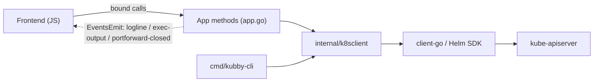

# Kubby — Architecture skeleton

**This file is the map, not the territory.** It holds only what is true across the
whole app; everything feature-specific lives in a branch under [`docs/`](docs/).

Read this file, then **open only the branch you are working in**. That is the
point of the split: a change to the Traffic view should not require loading the
Helm or AI documentation into your head (or into a model's context).

- *Build dependencies and commands* → [`../../docs/BUILD.md`](../../docs/BUILD.md)
- *How to use the application* → [README.md](README.md)
- *Why the project exists and what it must do* → [`../../docs/SPECIFICATION.md`](../../docs/SPECIFICATION.md)
- *Commands and the working loop* → [CLAUDE.md](CLAUDE.md)

---

## What Kubby is (one sentence)

A **desktop** app (Wails) for managing Kubernetes personally: load a `kubeconfig`
→ browse, edit, and operate resources through a Lens-style UI, with no in-cluster
agent.

## Tech stack & rationale

| Layer | Technology | Why |
|---|---|---|
| Backend / logic | **Go** + `client-go` (`dynamic`, `metadata`, `discovery`, `metrics`) + Helm Go SDK | The industry standard for Kubernetes; ships as one binary. |
| Desktop shell | **Wails v2** | Go-native, lighter than Electron, uses the OS's built-in WebView (WebView2 on Windows); no Rust (unlike Tauri), no sidecar process. |
| Frontend | **Vanilla JS + Vite** (no framework yet) | Sufficient at the current scale; a framework can come later if UI complexity demands it. |

## Data flow



Four rules that hold everywhere:

1. **The frontend never talks to Kubernetes directly.** It calls public methods of
   the Go `App` struct, which Wails binds into async JS functions (generated into
   `frontend/wailsjs/go/main/App.js` on every `wails build` / `wails dev`).
2. **`App` (`app.go`) is a thin layer** — it checks a cluster is connected, then
   delegates. Logic does not live here.
3. **All Kubernetes logic lives in `internal/k8sclient`** — plain Go, no Wails
   dependency — which is what lets `cmd/kubby-cli` reuse it. That reuse is not a
   nicety; it is the only way this app gets verified (see
   [docs/verification.md](docs/verification.md)).
4. **Streaming is pushed via Wails events**, not return values (logs, exec output,
   port-forward-closed).

## Cross-cutting invariants

These are load-bearing everywhere. Each is explained in the branch that owns it.

| Invariant | Owner |
|---|---|
| `QPS: 50` / `Burst: 100` on the rest.Config — client-go's default of 5/10 throttles an interactive UI into a stall | [docs/performance.md](docs/performance.md) |
| Fan out concurrently **in Go**, one bound call per screen — never one bound call per kind from JS | [docs/performance.md](docs/performance.md) |
| Use the **metadata client** wherever only a count or a name is needed | [docs/performance.md](docs/performance.md) |
| Any kind the cluster serves is addressable; a custom resource is referenced as **`Kind.group`** | [docs/kind-resolution.md](docs/kind-resolution.md) |
| `[hidden] { display: none !important }` in `app.css` is mandatory | [docs/frontend.md](docs/frontend.md) |
| A table that is **not** a resource list needs `class="plain"`, or it gets phantom bulk-select / Age / Actions columns | [docs/frontend.md](docs/frontend.md) |
| Writes are always behind an explicit confirmation | [docs/operations.md](docs/operations.md) |
| A permission Kubby could not check counts as **allowed** — never grey out on an unanswered probe | [docs/permissions.md](docs/permissions.md) |
| A value the cluster never declared is `-1`, rendered `—` — never `0` | [docs/right-sizing.md](docs/right-sizing.md) |
| Every YAML box is a CodeMirror instance read through its handle — not a `<textarea>` with `.value` | [docs/frontend.md](docs/frontend.md) |
| Verify against a real cluster with `kubby-cli`; the GUI cannot be screenshotted from a headless session | [docs/verification.md](docs/verification.md) |

## Branch map — open the one you need

| Branch | Covers | Open it when you are… |
|---|---|---|
| [docs/cluster-clients.md](docs/cluster-clients.md) | The `Cluster` struct and its six clients, timeouts, connecting, multi-cluster, recent connections | touching connection setup, or unsure *which* client to use |
| [docs/kind-resolution.md](docs/kind-resolution.md) | Discovery-backed kind → resource mapping, the `Kind.group` reference convention | making anything work for a kind that isn't hard-coded |
| [docs/resource-browsing.md](docs/resource-browsing.md) | List views, tables, the detail drawer, relations, search — **and the recipe to add a resource kind** | adding a kind, or changing a list/detail view |
| [docs/custom-resources.md](docs/custom-resources.md) | CRD-defined kinds as first-class sidebar sections | working on custom resources or the dynamic sidebar |
| [docs/apply-yaml.md](docs/apply-yaml.md) | Create / Import YAML, server-side apply, multi-document handling | changing how manifests are applied or edited |
| [docs/operations.md](docs/operations.md) | Scale, restart, rollback, pause, cordon/drain, trigger, delete | adding or changing a write action |
| [docs/permissions.md](docs/permissions.md) | `SelfSubjectAccessReview` probing, and how the UI disables what the token cannot do | adding an action, or wondering why a button is greyed out |
| [docs/right-sizing.md](docs/right-sizing.md) | Requests/limits vs actual usage, quota headroom, the advice lines | touching the Right-sizing view |
| [docs/traffic-flow.md](docs/traffic-flow.md) | The Traffic view: Ingress **and** Istio Gateway/VirtualService → Service → Pods | working on network topology |
| [docs/streaming.md](docs/streaming.md) | Log follow, exec terminal, port-forward — the three long-lived connections | touching anything that streams |
| [docs/ai-assistant.md](docs/ai-assistant.md) | The Ask AI tab, evidence collection, providers, what leaves the machine | changing AI behaviour or its data handling |
| [docs/helm.md](docs/helm.md) | Releases, repositories, Artifact Hub, dry-run previews | working on Helm |
| [docs/frontend.md](docs/frontend.md) | View system, drawer, theme tokens, command palette, dialogs, CSS conventions | writing any UI |
| [docs/performance.md](docs/performance.md) | The performance contract and how it was measured | adding anything that lists resources |
| [docs/verification.md](docs/verification.md) | `kubby-cli`, tests, **version & diagnostics**, the local kind cluster, and GUI verification limits | checking behaviour after the source builds |

## Directory map

```
src/kubby/
├── app.go                      # App layer: every method bound for the frontend. Registry of *k8sclient.Cluster (multi-cluster) + active pointer + logCancel + pfSessions + execSess.
├── main.go                     # Wails bootstrap (embeds frontend/dist, registers App).
├── recent.go                   # Recent-connections store (%AppData%/kubby/recent.json — paths + context only).
├── ai.go                       # (package main) AI provider config + multi-turn chat clients. Stores %AppData%/kubby/ai.json (0600).
├── diagnostics.go              # AppVersion + Diagnostics (the copy-pasteable bug report) + CopyToClipboard  → verification.md
├── diagnostics_test.go         # report shape + "never leaks the API key"                                   → verification.md
├── wails.json                  # Wails config — the `info` block fills the exe's version metadata.
│
├── internal/buildinfo/         # Version identity shared by both binaries (ldflags + Go VCS stamps)          → verification.md
│
├── internal/k8sclient/         # ★ ALL Kubernetes logic (plain Go, shared by app + CLI)
│   ├── client.go               #   Cluster struct + New()/NewFromContent() + Contexts()          → cluster-clients.md
│   ├── apiindex.go             #   ResolveKind / ResolveGVK — discovery-backed, cached           → kind-resolution.md
│   ├── resources*.go           #   Per-kind List functions (4 files, grouped by sidebar section) → resource-browsing.md
│   ├── detail.go               #   gvrByKind, resourceFor(), GetYAML/UpdateYAML, DeleteResource  → resource-browsing.md
│   ├── describe.go             #   GetDetail (per-kind + genericDetail), ListEvents, age()       → resource-browsing.md
│   ├── relations.go            #   DeploymentTree/ServiceTree/IngressTree + NodeMetrics/TopPods  → resource-browsing.md
│   ├── explore.go              #   PodsOnNode, NamespaceSummary, SearchResources                 → resource-browsing.md
│   ├── diagnostics.go          #   Diagnose — server version, capabilities, first failure        → verification.md
│   ├── counts.go               #   SidebarCounts — every nav badge in one concurrent call        → performance.md
│   ├── overview.go             #   OverviewSnapshot — one bounded dashboard fan-out              → performance.md
│   ├── custom.go               #   CustomKinds + ListCustom (CRD kinds as sections)              → custom-resources.md
│   ├── apply.go                #   ApplyYAML + ApplyPreview (dry-run diff), any kind             → apply-yaml.md
│   ├── access.go               #   CanI — SelfSubjectAccessReview per kind, cached               → permissions.md
│   ├── rightsizing.go          #   Sizing — requests/limits vs usage, quota, advice              → right-sizing.md
│   ├── actions.go              #   Scale/Restart/Pause/Rollback, cordon/drain, RunCronJobNow     → operations.md
│   ├── netflow.go              #   NetworkTopology → FlowIngress/FlowService/FlowPod             → traffic-flow.md
│   ├── istioflow.go            #   Istio Gateway + VirtualService into the same lanes            → traffic-flow.md
│   ├── logstream.go            #   StreamLogs (follow)                                           → streaming.md
│   ├── portforward.go          #   StartPortForward (SPDY)                                       → streaming.md
│   ├── exec.go                 #   StartExec (line-mode)                                         → streaming.md
│   ├── ai.go                   #   DiagnosticContext → AIContext                                 → ai-assistant.md
│   ├── helm.go, helmrepo.go    #   Helm Go SDK in-process + repositories.yaml                    → helm.md
│   └── artifacthub.go          #   Chart search/details over HTTP                                → helm.md
│
├── cmd/kubby-cli/main.go       # Secondary CLI (cobra) — the verification harness                → verification.md
│
└── frontend/                                                                                     → frontend.md
    ├── index.html              # All markup + the SVG icon sprite
    ├── src/editor.js           # The shared CodeMirror YAML editor (drawer, Create, Import, Helm values)
    └── src/{main.js, app.css, style.css}
```

> `frontend/wailsjs/`, `frontend/dist/`, `build/bin/`, `node_modules/` are
> **generated** — never hand-edit.

## Keeping these docs honest

- One fact, one file. If something is true of two features, it belongs in this
  skeleton's *Cross-cutting invariants* table with the detail in exactly one branch.
- A branch documents **decisions and traps**, not a restatement of the code. If a
  paragraph would go stale the moment a line changes, it should be a comment in
  the code instead.
- When you add a feature, add its branch here **and** link it from the map above.
  A branch nobody can find is worse than no branch.
